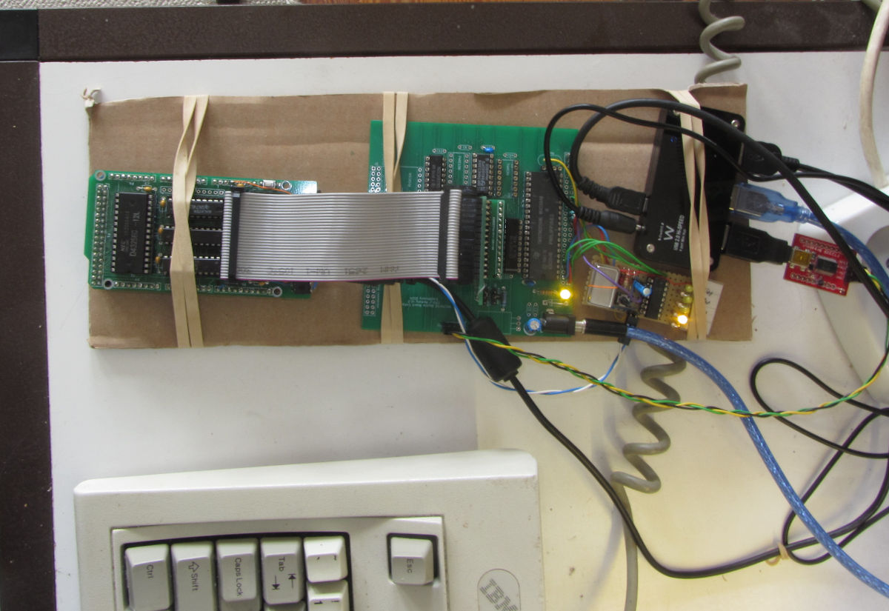

# TMS70C02-Monitor
A monitor for my T.I. TMS70C02 microcontroller board

The board is intended as half of a dual-board trainer-type computer 
consisting of a CPU-memory board and a display/keyboard board. But for 
the first phase of development, a serial monitor is written, because
the TMS70C02 has an internal serial port, and it is simpler.

## Functionality

Here the actual and planned (with * prefix) commands:

        ** TMS70C02 Monitor Help Menu V0.2.0 **
         Caaaa - Call subroutine at aaaa
         D[||+|-|[aaaa[-bbbb]]] - Dump memory from aaaa to bbbb
         E[e] - View/set echo
         Faaaa eeee dd - Fill memory from aaaa to eeee with dd
         Gaaaa - jump to address aaaa
         Maaaa bb - Modify memory location
         H - Help menu
         Raaaa eeee - RAM test from aaaa to eeee
        *:ssaaaattdddddd....ddcc - receive Intel-hex record
         * = not yet implemented

## Development environment

The assembler is asl (AS V1.42 Beta [Bld 269]) from 
http://john.ccac.rwth-aachen.de:8000/as/download.html#CSRC
The assembler is operated via the asl.sh shell script.

Downloading the code to the board is done with the ROM-Emulator
https://github.com/electrickery/ROM-emulator. This makes development for 
the board almost as simple as for the Arduino, at least for the hardware
side.

The current hardware setup looks like this:

